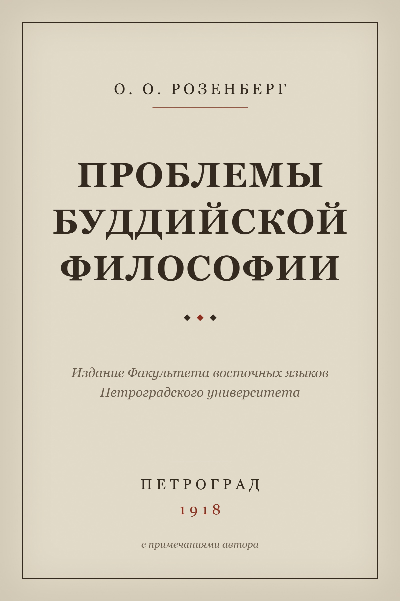

# О. О. Розенберг. Проблемы буддийской философии

Розенберг О. О. (1888–1919). *Проблемы буддийской философии.* Петроград: Издание
Факультета восточных языков Петроградского университета, 1918.

**[Скачать epub](rozenberg-problemy-buddiyskoy-filosofii.epub)** (471 КБ)



## О книге

Первая на русском языке систематическая работа о теории дхарм как ядре буддийской
философии. Розенберг учился у японских учёных в Токио и работал по китайским переводам
и японским компендиумам школы Куся, потому что санскритский текст «Абхидхармакошабхашьи»
Васубандху тогда считался утраченным (рукопись нашли в Тибете только в 1935 году).
Отсюда и сила книги, и её ограничения.

Как источник знаний об абхидхарме книга устарела: источниковая база с тех пор изменилась
принципиально, а неокантианская рамка («буддизм как теория опыта») сегодня выглядит
проекцией европейской философии начала XX века. Живым остался методологический тезис,
за который Розенберга и стоит помнить: буддийскую философию нельзя понять по одним
каноническим текстам, минуя живую комментаторскую традицию. В 1918 году это шло против
всей европейской буддологии. Плюс чисто практическое: изложение теории дхарм здесь
до сих пор самое внятное на русском.

## Состав

- Предисловие автора
- Главы I–XIX
- Примечания О. О. Розенберга (авторские, со ссылками из текста)
- Колофон с описанием источника и правового статуса

Научный аппарат издания 1991 года — вступительная статья и комментарии
А. Н. Игнатовича (1947–2001) — **не включён**: он охраняется авторским правом
приблизительно до 2072 года.

## Источник

Текст взят из электронной библиотеки [PSYLIB](https://psylib.org.ua/books/rozeo02/),
которая воспроизводит издание: Розенберг О. О. *Труды по буддизму.* М.: Наука, Главная
редакция восточной литературы, 1991. Орфография и синтаксис приведены к современным
нормам, сокращения раскрыты — по указанному изданию. Такая правка носит технический
характер и отдельного авторского права не создаёт.

При сборке вычищена навигационная обвязка страниц, исправлена кодировка (cp1251 → UTF-8),
перекрёстные ссылки на примечания переписаны так, чтобы работать внутри epub.

## Правовой статус

О. О. Розенберг умер в 1919 году. Срок действия исключительного права истёк: по
советскому законодательству (50 лет) — в 1969 году, то есть к моменту введения
нынешнего срока 70 лет текст уже был в общественном достоянии, и продление на него
не распространяется. Свободен в России, в ЕС (с 1990 года) и в США (как всё изданное
до 1931 года).

## Сборка

```sh
cd build
python3 build.py
```

`build.py` скачивает страницы с PSYLIB в `cache/`, чистит разметку в `clean/` и вызывает
pandoc. Обложка рисуется отдельным скриптом `cover.py` (Pillow, шрифт Georgia).

---

## In English

Otton O. Rosenberg (1888–1919), *Problems of Buddhist Philosophy* (Petrograd: Faculty of
Oriental Languages, Petrograd University, 1918). In Russian.

The first systematic Russian-language study of the theory of *dharmas* as the core of
Buddhist philosophy. Rosenberg trained under Japanese scholars in Tokyo and worked from
Chinese translations and Japanese Kusha-school compendia, because the Sanskrit text of
Vasubandhu's *Abhidharmakośabhāṣya* was then presumed lost (the manuscript was found in
Tibet only in 1935). That accounts for both the book's strength and its limits.

As a source on Abhidharma it is superseded: the textual basis has changed fundamentally,
and the neo-Kantian framing of Buddhism as a "theory of experience" now reads as a
projection of early twentieth-century European philosophy. What survives is the
methodological claim Rosenberg is worth remembering for: Buddhist philosophy cannot be
understood from canonical texts alone, bypassing the living commentarial tradition. In 1918
that ran against the whole of European Buddhology.

**Contents:** author's preface, chapters I–XIX, Rosenberg's own endnotes (linked from the
text), and a colophon documenting provenance and legal status. The 1991 editorial apparatus
by A. N. Ignatovich (1947–2001) is **excluded**, as it remains under copyright until roughly
2072.

**Source:** the [PSYLIB](https://psylib.org.ua/books/rozeo02/) digital library, reproducing
Rosenberg O. O., *Works on Buddhism* (Moscow: Nauka, Oriental Literature, 1991), where
spelling was modernised and abbreviations expanded. That editing is technical rather than
creative and creates no separate copyright.

**Legal status:** Rosenberg died in 1919. Protection lapsed in 1969 under the then-applicable
Soviet term of 50 years, so the later extension to 70 years does not revive it. The text is
in the public domain in Russia, in the EU (since 1990) and in the United States (as a work
published before 1931).
