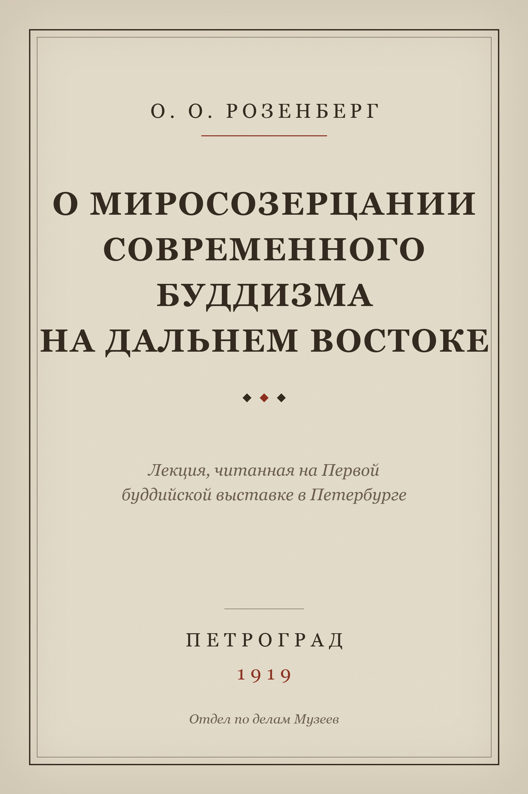

# О. О. Розенберг. О миросозерцании современного буддизма на Дальнем Востоке

Розенберг О. О. (1888–1919). *О миросозерцании современного буддизма на Дальнем Востоке.*
Лекция, читанная на Первой буддийской выставке в Петербурге. Пб.: Издание Отдела по делам
Музеев и охраны памятников Искусства и Старины, 1919.

**[Скачать epub](rozenberg-o-mirosozercanii.epub)** (235 КБ)



## О тексте

Публичная лекция, прочитанная на Первой буддийской выставке в Петербурге. Последняя работа
Розенберга: он умер в 1919 году, тридцати одного года.

Три части — «Путь мышления», «Путь созерцания», «Путь веры» — это попытка описать буддизм
Китая и Японии не как набор доктрин, а как три разных способа, которыми традиция отвечает
на один вопрос. Розенберг говорит о живом буддизме, который он видел сам, учась в Токио, а
не о реконструкции по каноническим текстам, и с полемическим прицелом: европейская
буддология тогда считала дальневосточные школы поздним вырождением индийского учения.

Хорошее первое чтение перед [«Проблемами буддийской
философии»](../rozenberg-1918-problemy-buddiyskoy-filosofii/): здесь тот же автор говорит
без терминологического аппарата, на слушателя, и видно, зачем ему вообще нужна теория дхарм.

## Состав

Полный текст лекции: вступление, «I. Путь мышления», «II. Путь созерцания»,
«III. Путь веры», «Заключение». Плюс колофон с описанием источника и правового статуса.

Девять примечаний, которыми текст снабжён в издании 1991 года, составлены
А. Н. Игнатовичем (1947–2001) и охраняются авторским правом — они **не включены**, вместе с
отсылками к ним из текста. Своих примечаний у лекции нет: это устное выступление,
напечатанное без научного аппарата.

## Источник

Текст из электронной библиотеки [PSYLIB](https://psylib.org.ua/books/_rozeo01.htm),
воспроизводящей издание: Розенберг О. О. *Труды по буддизму.* М.: Наука, Главная редакция
восточной литературы, 1991, с. 18–42.

При сборке удалена навигационная обвязка страницы, исправлена кодировка (cp1251 → UTF-8),
заголовки разделов подняты до уровня глав, изъяты примечания 1991 года.

## Правовой статус

О. О. Розенберг умер в 1919 году, срок охраны истёк задолго до введения нынешнего
семидесятилетнего срока. Текст свободен в России, ЕС и США.

## Сборка

```sh
cd build
python3 build.py
```

Источник здесь — одна HTML-страница, поэтому скрипт проще, чем у тома 1918 года: он режет
страницу по двум границам (конец титульного блока и начало примечаний), снимает маркеры
сносок и отдаёт результат pandoc.

---

## In English

Otton O. Rosenberg (1888–1919), *On the Worldview of Contemporary Buddhism in the Far East.*
A lecture delivered at the First Buddhist Exhibition in Petersburg (Petrograd: Department of
Museums and Preservation of Monuments of Art and Antiquity, 1919). In Russian.

Rosenberg's last work; he died that same year, aged thirty-one. Its three parts — the way of
thought, the way of contemplation, the way of faith — describe Chinese and Japanese Buddhism
not as a set of doctrines but as three distinct ways a tradition answers a single question.
He writes about the living Buddhism he had studied in Tokyo rather than a reconstruction from
canonical texts, and polemically: European Buddhology of the time treated the Far Eastern
schools as a late degeneration of Indian teaching.

A good first read before *[Problems of Buddhist
Philosophy](../rozenberg-1918-problemy-buddiyskoy-filosofii/)*: the same author speaking
without technical apparatus, to an audience, which makes it clear why he needed a theory of
*dharmas* at all.

**Contents:** the complete lecture plus a colophon documenting provenance and legal status.
The nine notes added in the 1991 edition are by A. N. Ignatovich (1947–2001) and remain under
copyright; they are excluded, along with the in-text markers pointing to them. The lecture
itself carries no notes — it was printed as delivered.

**Source:** the [PSYLIB](https://psylib.org.ua/books/_rozeo01.htm) digital library,
reproducing Rosenberg O. O., *Works on Buddhism* (Moscow: Nauka, Oriental Literature, 1991),
pp. 18–42.

**Legal status:** public domain in Russia, the EU and the United States.
